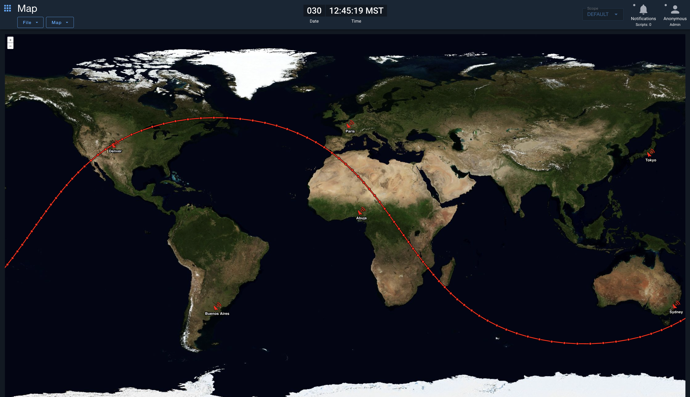

# OpenC3 COSMOS Map Tool

A map visualization tool for OpenC3 COSMOS that displays geographic positions from telemetry data in real-time. Supports WMTS and TMS tile services for base maps, with the ability to track satellite/vehicle positions and place static markers.



## Features

### Map Services
- **WMTS (Web Map Tile Service)**: Connect to WMTS endpoints by providing a GetCapabilities URL. The tool automatically discovers available layers and tile matrix sets.
- **TMS (Tile Map Service)**: Connect to XYZ tile servers using URL templates with `{z}`, `{x}`, `{y}` placeholders.

### Tracks
Track moving objects by subscribing to telemetry data:
- Select target, packet, and lat/lon telemetry items
- Configurable trail time (how much history to display)
- Customizable track colors
- Support for historical data playback with start/end times
- Automatic antimeridian handling for global tracks
- Hover tooltips showing timestamp, latitude, and longitude

### Markers
Place static markers on the map:
- Multiple icon options: Ground Station, Antenna, Aircraft, Satellite, Tower, Ship, Vehicle, Pin, Flag, Star, Quadcopter, Helicopter
- Customizable colors
- Optional labels

### Configuration
- Save and load configurations to preserve map settings, tracks, and markers
- Configurations can be loaded via URL parameter: `?config=myconfig`

## Menu Options

### File Menu
- **Open Configuration**: Load a previously saved configuration
- **Save Configuration**: Save current map settings, tracks, and markers
- **Reset Configuration**: Clear all settings and return to defaults
- **Set Map Server**: Configure WMTS or TMS tile source
- **Map Options**: Set map center coordinates and zoom level
- **Reset View**: Return to default map view

### Map Menu
- **Add Track**: Create a new telemetry track
- **View Tracks**: List, edit, or delete existing tracks
- **Add Marker**: Place a static marker on the map
- **View Markers**: List, edit, or delete existing markers
- **Clear All Tracks**: Remove all tracks
- **Clear All Markers**: Remove all markers

## Building

```bash
pnpm install --frozen-lockfile --ignore-scripts
rake build VERSION=1.0.0
```

## Installing into OpenC3 COSMOS

1. Go to the OpenC3 Admin Tool, Plugins Tab
2. Click the install button and choose your plugin.gem file
3. Click Install

## Development

```bash
# Install dependencies
pnpm install

# Build for development (watch mode)
pnpm run serve

# Build for production
pnpm run build

# Lint
pnpm run lint
```